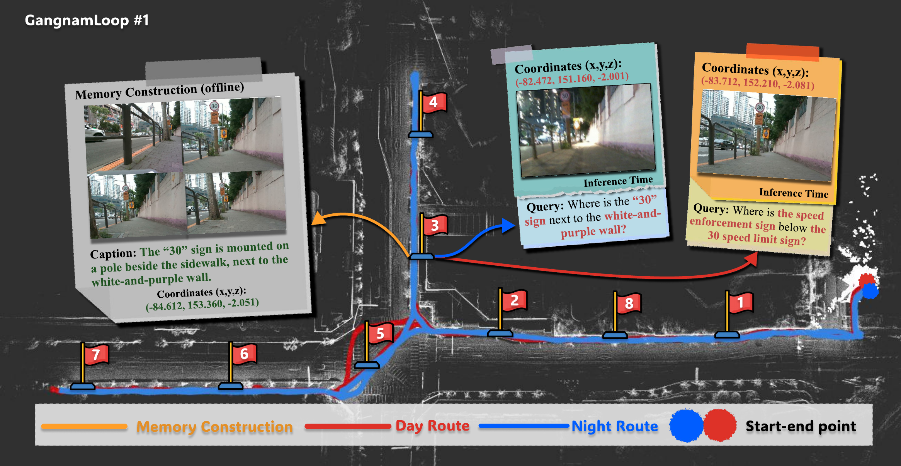
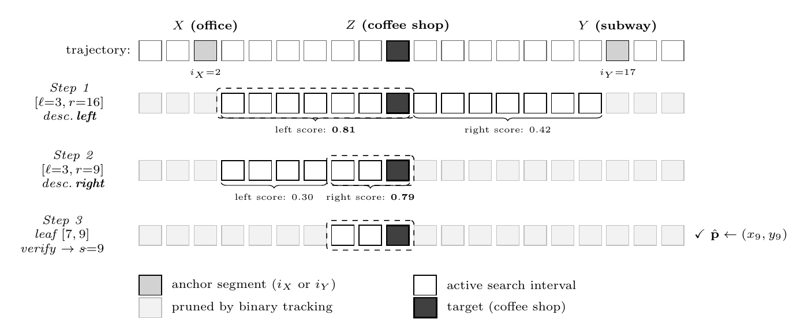
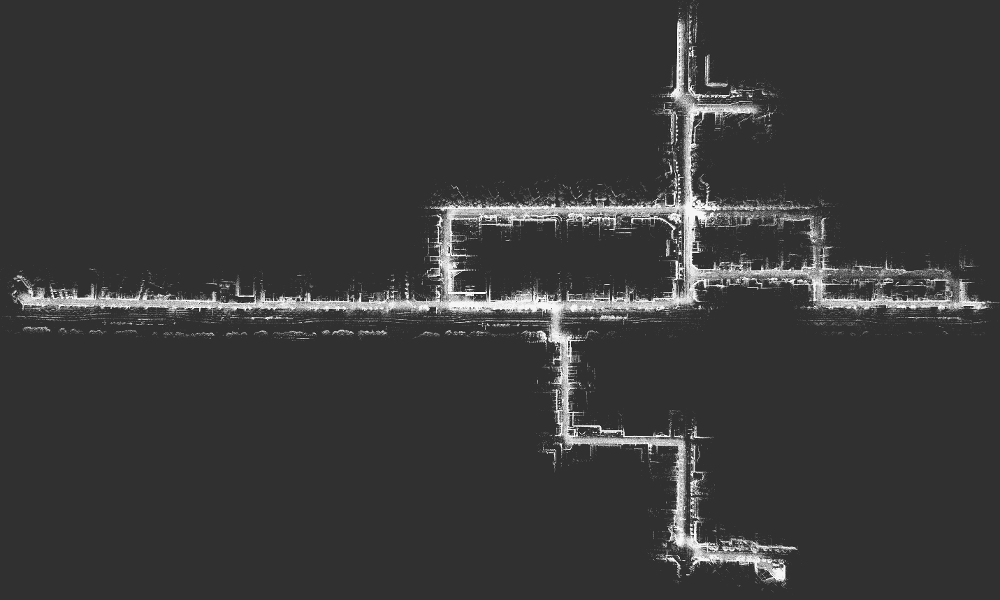

# BinTrack

[](https://ndb796.github.io/BinaryTracking/)
[](https://ndb796.github.io/BinaryTracking/)
[](https://www.python.org/)

### Binary Tracking for Spatial QA and Navigation with Open Vision-Language Models

- This repository provides the official implementation of **BinTrack** and the **GangnamLoop** benchmark.
- **BinTrack** is a fully open-source Spatial Question Answering (SQA) agent for service robots. It runs entirely onboard with open-source models and needs no closed-source API at inference time.
- **Project page**: [ndb796.github.io/BinaryTracking](https://ndb796.github.io/BinaryTracking/) &nbsp;|&nbsp; **Paper**: arXiv &nbsp;|&nbsp; **Dataset**: GangnamLoop (released on Hugging Face soon)

### Authors

- [Dongbin Na](https://github.com/ndb796)<sup>\*†</sup>, Chanwoo Kim<sup>\*</sup>, Soonbin Rho, Giyun Choi, Gangbok Lee, Dooyoung Hong<sup>†</sup>
- RGA Inc.
- <sup>\*</sup>Equal contribution. &nbsp;<sup>†</sup>Correspondence to `dongbinna@postech.ac.kr` and `dooyoung@rgarobot.com`

### Abstract

> Spatial question answering lets a service robot turn a query such as *"where can I find a dry cleaner on the way back home?"* into a metric coordinate that navigation can act on. Prior approaches rely on retrieval-augmented agents built on closed-source models such as GPT-4o, but robots in the real world often cannot depend on online closed-source models due to network instability, communication latency, and deployment cost.
>
> We present **BinTrack**, a simple yet effective, fully open-source spatial-localization agent that exploits the temporal ordering of a robot's trajectory: it performs a **binary search** over the segments between two anchor landmarks identified from the query. BinTrack improves overall accuracy by up to **22.8%** over open-source implementations and matches the reported closed-source result on the global category of SpaceLocQA, while running more than **1.5×** faster. Every component is open-source, so the full pipeline is reproducible without any API access. We also release **GangnamLoop**, a multi-trip outdoor benchmark recorded by a quadruped robot on public streets, revisiting the same locations under different conditions and pairing the robot's low viewpoint with the human owner's.

[](./assets/overview.png)

### How It Works

BinTrack reads the route as a temporally ordered list of segments and localizes a place through various components.

[](./assets/binary_tracking.png)

> **Binary Tracking.** Given two anchors `X` and `Y` from the query, the agent compares the semantic evidence of the left and right halves of the current interval, keeps the stronger half, and repeats until the interval shrinks to a small leaf where the verifier selects the target segment and returns its coordinate.

- **Multi-view memory** — A segment can be captioned three ways (`full` / `center` / `detail`) so retrieval can match the right view.
- **Binary Tracking** — a VL-guided binary search over the segments between `X` and `Y`, halving the interval until it brackets the target.

The planning agent is a text-only 32B model and the verifier is a separate 7B vision-language model; keeping the two roles apart avoids the vote-count hallucination of a single combined model.

### Results

#### SpaceLocQA — success rate (%) @ τ = 15 m, 270 queries

| Method | Backbone | Basic | Local | Global | Overall |
| --- | --- | :---: | :---: | :---: | :---: |
| Meta-Memory | closed-source | 67.8 | 61.8 | 62.2 | 63.9 |
| Meta-Memory | open-source | 50.0 | 51.1 | 32.6 | 44.6 |
| ReMEmbR | closed-source | 58.5 | 57.8 | 46.3 | 54.2 |
| ReMEmbR | open-source | 56.7 | 61.1 | 32.6 | 50.1 |
| **BinTrack (ours)** | **open-source** | **74.4** | **65.6** | **62.2** | **67.4** |

Using only open-source models, BinTrack outperforms every open-source baseline across all categories and ties the closed-source Meta-Memory on the hardest `global` category (62.2).

#### GangnamLoop — success rate (%) @ τ = 15 m, 360 queries (32B agent)

| Method | Backbone | R1 | R2 | R3 | R4 | R5 | R6 | R7 | R8 | Overall |
| --- | --- | :-: | :-: | :-: | :-: | :-: | :-: | :-: | :-: | :---: |
| Meta-Memory | open-source | 15.6 | 31.1 | 0.0 | 6.7 | 20.0 | 8.9 | 26.7 | 15.6 | 15.6 |
| ReMEmbR | open-source | 24.4 | 33.3 | 4.4 | 8.9 | 24.4 | 11.1 | 31.1 | 6.7 | 18.0 |
| **BinTrack (ours)** | **open-source** | **55.6** | **60.0** | **24.4** | **40.0** | **60.0** | **31.1** | **57.8** | **33.3** | **45.3** |

### Environment

| Role | Model |
| --- | --- |
| Captioner (memory build) | `Qwen2.5-VL-7B-Instruct` |
| Verifier (4-view ensemble) | `Qwen2.5-VL-7B-Instruct` (shared) |
| Planning agent | `Qwen2.5-32B-Instruct-AWQ` |
| Text encoder | `mxbai-embed-large-v1` |
| Vector database | Milvus (Lite) |

```bash
# Python 3.10 (conda recommended)
conda create -n vln python=3.10 -y
conda activate vln

# Pinned versions verified for Qwen2.5-VL
pip install torch==2.4.1                 # CUDA 12.x build
pip install transformers==4.49.0         # newer releases break on torch.library.custom_op
pip install accelerate==1.0.1 "tokenizers>=0.21,<0.22" "setuptools<81"
pip install pymilvus sentence-transformers qwen-vl-utils autoawq pandas numpy
```

### The GangnamLoop Benchmark

[](./assets/common_map.png)

A quadruped robot walks four out-and-back routes through Gangnam, Seoul, then walks each one again under the opposite lighting. Day (red) and night (blue) trajectories are aligned on a shared SLAM map.

| Recordings | Queries | Day/night pairs | Viewpoints | Total recording | RGB frames |
| :---: | :---: | :---: | :---: | :---: | :---: |
| 8 | 360 | 4 | 2 (robot + owner) | 221 min | 383,800 |

**E → A → E** &nbsp;(R1 day · R8 night)

**E → B → E** &nbsp;(R2 day · R7 night)

**E → C → E** &nbsp;(R3 night · R6 day)

**E → D → E** &nbsp;(R4 night · R5 day)

All eight recordings share one SLAM coordinate frame:

#### Recording schedule

| # | Day | Condition | Round trip | Pair | Duration | RGB frames | Queries |
| :-: | --- | --- | --- | :-: | --- | ---: | :-: |
| 1 | Day 1 | day | E → A → E | #8 | 14:43 | 25,545 | 45 |
| 2 | Day 1 | day | E → B → E | #7 | 12:37 | 22,020 | 45 |
| 3 | Day 1 | night | E → C → E | #6 | 32:47 | 56,883 | 45 |
| 4 | Day 1 | night | E → D → E | #5 | 45:12 | 78,507 | 45 |
| 5 | Day 2 | day | E → D → E | #4 | 49:40 | 86,208 | 45 |
| 6 | Day 2 | day | E → C → E | #3 | 35:19 | 61,397 | 45 |
| 7 | Day 2 | night | E → B → E | #2 | 13:41 | 23,753 | 45 |
| 8 | Day 2 | night | E → A → E | #1 | 17:03 | 29,487 | 45 |

Recordings (1,8), (2,7), (3,6), (4,5) share a destination but differ in time of day, forming the day/night cross-domain evaluation set.

The dataset will be released on **Hugging Face**; a link will be added here once it is published. Expected layout:

### Real-Robot Deployment

We are bringing BinTrack onboard our service-robot platform. Recorded runs and a deployment guide will be added here and on the [project page](https://ndb796.github.io/BinaryTracking/).

### Citation

If this work is useful for your research, please cite our paper:

```bibtex
@article{na2026bintrack,
  title   = {Binary Tracking for Spatial QA and Navigation with Open Vision-Language Models},
  author  = {Na, Dongbin and Kim, Chanwoo and Rho, Soonbin and Choi, Giyun and Lee, Gangbok and Hong, Dooyoung},
  year    = {2026}
}
```
